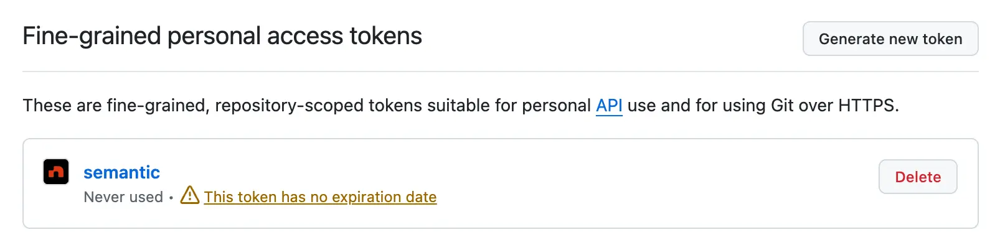
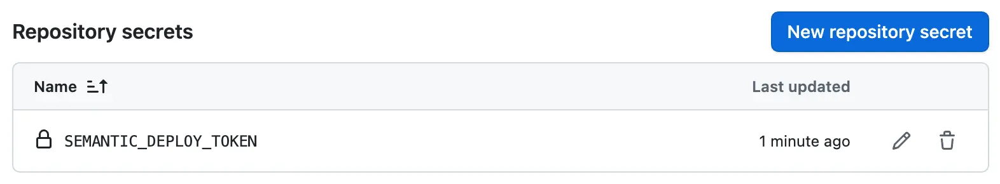
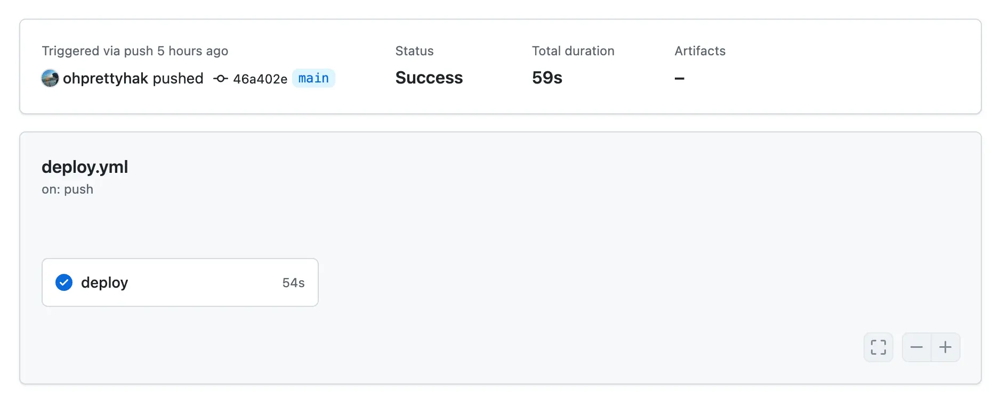
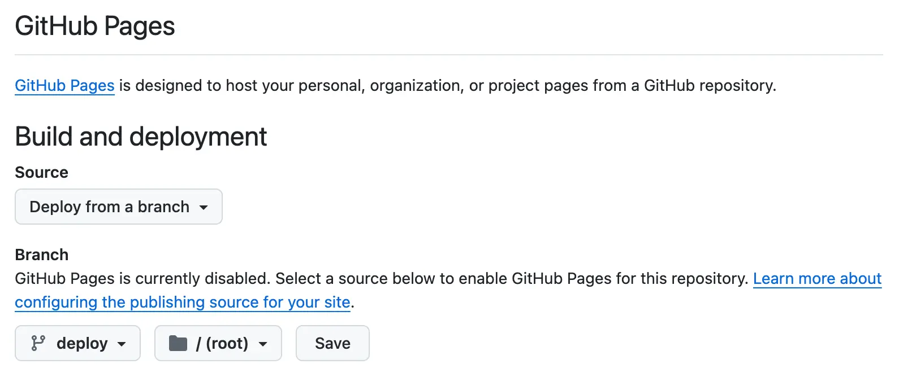

To deploy your forked version of `semantic`, you'll need a server — whether that's your local machine, an EC2 instance, or a cloud platform like `Vercel` or `Netlify`.

However, since `semantic` is built entirely with `Static Site Generation (SSG)`, deploying via `GitHub Pages` is not only possible — it's a great fit.

## ① Overview
The `semantic` project includes a preconfigured GitHub Actions workflow:
`.github/workflows/deploy.yml`

This workflow is triggered automatically whenever a commit is pushed to the `main` branch. It builds the project and pushes the output (`out` directory) to the `deploy` branch.

This makes `deploy` a dedicated branch for hosting build artifacts — perfect for **GitHub Pages**.

Before it can work, we need to configure proper permissions for the workflow.

## ② Setting up Workflow Secrets
To push to the `deploy` branch, GitHub Actions needs an access token with the appropriate permissions.

Here’s the relevant part of the `deploy.yml` file:
```yml
- name: Deploy
  uses: peaceiris/actions-gh-pages@v4
  with:
    publish_dir: ./out
    publish_branch: deploy
    github_token: ${{ secrets.SEMANTIC_DEPLOY_TOKEN }}
```

As shown, the workflow uses a secret called `SEMANTIC_DEPLOY_TOKEN`.

### Creating a Personal Access Token

1. <p>Visit your <a href="https://github.com/settings/personal-access-tokens" target="_blank" rel="noopener noreferrer">Personal access tokens</a> page.</p>
2. <p>Click <strong>"Generate new token"</strong>.</p>
3. <p>Select your forked <code>semantic</code> repository.</p>
4. <p>Under **Repository permissions**, enable:<br/> - <code>Contents</code> (Read and Write)<br/> - <code>Metadata</code> (Read-only)</p>

Once generated, GitHub will show the token **only once**:



> [!TIP]
> <strong>Be sure to copy and store the token securely.</strong>
>
> You won’t be able to see it again.

> [!CAUTION]
> Never share this token with anyone.

### Adding the Token to GitHub Secrets

1. <p>Go to your forked <code>semantic</code> repository.</p>
2. <p>Navigate to <strong>Settings → Secrets and variables → Actions</strong>.</p>
3. <p>Under the <strong>Repository secrets</strong> section, click <strong>"New repository secret"</strong>.</p>

Enter the following:

- <p><strong>Name</strong>: <code>SEMANTIC_DEPLOY_TOKEN</code></p>
- <p><strong>Secret</strong>: Paste the token you generated</p>
- <p>Click <strong>"Add secret"</strong></p>

If added successfully, it should look like this:



## ③ Triggering the Build Workflow

With everything in place, it’s time to run the build workflow.

1. <p>Go to the <strong>Actions</strong> tab in your repository.</p>
2. <p>If a previous build failed, open the run and click <strong>"Re-run all jobs"</strong>.</p>

Or, trigger the workflow by simply pushing a commit to the `main` branch — even a small change like updating a README file will work.



If successful, a new branch named `deploy` should now appear in your repository.

## ④ Publishing to GitHub Pages

Almost done — now let’s connect the `deploy` branch to GitHub Pages.
1. <p>Go to <strong>Settings → Pages</strong> in your repository.</p>

2. <p>Under Build and deployment:<br/> - <strong>Source</strong>: Select <code>Deploy from a
      branch</code><br/> - <strong>Branch</strong>: Choose the <code>deploy</code> branch</p>

3. <p>Click <strong>Save</strong>.</p>



Wait for the GitHub Actions deployment to finish — and your blog will be live!

> [!IMPORTANT]
> Need help? Open an{" "}<a href="https://github.com/nylon-bricks/semantic/issues" target="_blank" rel="noopener noreferrer">issue</a> and we'll be happy to assist you.
